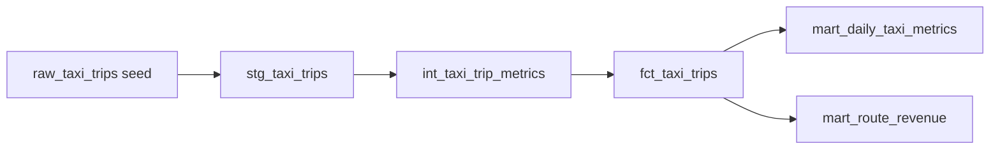

# NYC Taxi dbt Analytics

Public analytics engineering project using dbt, DuckDB, and NYC taxi-style trip data.

## What This Demonstrates

- Layered dbt modeling: staging, intermediate, facts, and marts.
- Data quality tests for keys, accepted values, and non-negative metrics.
- Local-first development with DuckDB, no paid warehouse required.
- CI workflow that runs `dbt build` and generates dbt docs.
- Stakeholder-facing marts for revenue, demand, route, and tipping analysis.
- Executive Streamlit dashboard that turns marts into business-facing answers.

## Business Questions

1. Which pickup boroughs generate the most daily taxi revenue?
2. Which borough-to-borough routes have the highest average trip value?
3. How do distance bands relate to tipping behavior?

## Architecture



## Quickstart

Create and activate a Python virtual environment, then install dbt:

```powershell
py -3.12 -m venv .venv
.\.venv\Scripts\Activate.ps1
python -m pip install -e .
dbt deps --profiles-dir .
dbt build --profiles-dir .
dbt docs generate --profiles-dir .
dbt docs serve --profiles-dir .
```

Launch the dashboard after `dbt build` creates `nyc_taxi.duckdb`:

```powershell
streamlit run dashboard/app.py
```

## Dashboard

The Streamlit dashboard is designed as an executive metrics command center. It answers:

- Where is taxi revenue concentrated by pickup borough?
- Which borough-to-borough routes create the most value?
- How does distance band relate to tipping behavior?
- Can stakeholders trust the metrics behind the charts?

Dashboard files live in `dashboard/`:

```text
dashboard/
  app.py          # Streamlit UI and visual command-center layout
  data_access.py  # DuckDB reads from dbt-built marts
  metrics.py      # Tested KPI and chart transformations
```

## Model Layers

- `models/staging/stg_taxi_trips.sql`: typed and cleaned source records.
- `models/intermediate/int_taxi_trip_metrics.sql`: reusable trip metrics.
- `models/marts/fct_taxi_trips.sql`: trip-level fact table.
- `models/marts/mart_daily_taxi_metrics.sql`: daily demand and revenue by pickup borough.
- `models/marts/mart_route_revenue.sql`: route-level revenue and tipping metrics.

## Data Dictionary

| Model | Grain | Purpose |
| --- | --- | --- |
| `fct_taxi_trips` | One row per trip | Trip-level analytics with duration, distance, fare, and tip metrics. |
| `mart_daily_taxi_metrics` | One row per service date and pickup borough | Daily demand, revenue, and trip profile metrics. |
| `mart_route_revenue` | One row per pickup borough, dropoff borough, and distance band | Route performance and tipping behavior. |

## Notes

The seed file is intentionally small so the project is easy to run in CI and simple for reviewers to inspect. The same modeling pattern can be pointed at larger public NYC TLC parquet files for a more production-sized extension.
