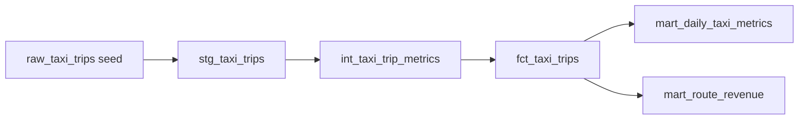

# Architecture

This project uses a local DuckDB database and dbt to model a small public-style NYC taxi trip sample into analytics-ready marts.

## Modeling Layers

- `staging`: cleans source values, applies types, and filters impossible records.
- `intermediate`: calculates reusable trip metrics such as duration, distance band, and tip share.
- `marts`: exposes fact and aggregate tables for stakeholder-facing analysis.

## Quality Gates

The project uses dbt schema tests for uniqueness, not-null constraints, accepted values, and non-negative numeric metrics. GitHub Actions runs `dbt build` and `dbt docs generate` on each push and pull request to keep the public repo reproducible.
